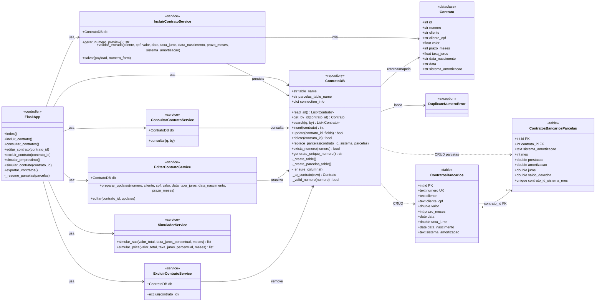
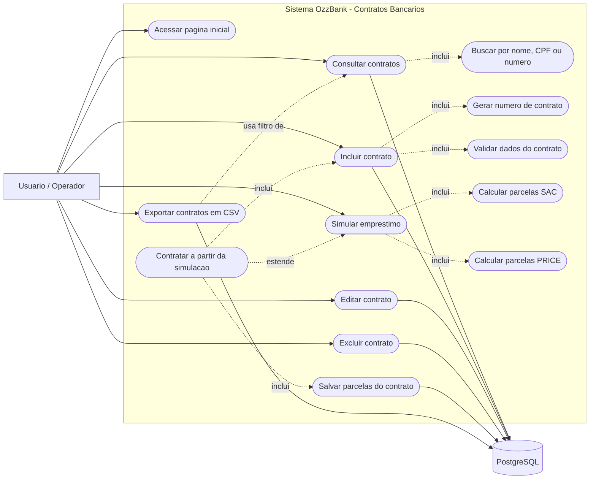

# Diagramas Mermaid - Projeto Contratos

Este documento contem os diagramas prontos em Mermaid e o escopo usado para representar o projeto.

## Diagrama de Classe

### Escopo

- Representa as principais classes Python do projeto Flask.
- Representa tambem as tabelas persistidas no PostgreSQL, identificando PK e FK.
- A tabela `contratos_bancarios` guarda os dados principais do contrato.
- A tabela `contratos_bancarios_parcelas` guarda as parcelas simuladas para contratos SAC ou PRICE.
- A FK `contrato_id` aponta para `contratos_bancarios.id` com exclusao em cascata.
- Os services manipulam regras de entrada, consulta, edicao, exclusao e simulacao.
- O arquivo `app.py` atua como camada de rotas/controlador e usa os services.

## Diagrama de Caso de Uso

### Escopo

- Representa a interacao de um usuario com o sistema web OzzBank.
- O ator principal e o usuario/operador do sistema.
- O sistema permite consultar, incluir, editar, excluir, simular e exportar contratos.
- A simulacao calcula SAC e PRICE; a contratacao a partir da simulacao reaproveita valor, taxa, prazo e sistema escolhido.
- A exportacao gera CSV a partir da consulta atual.
- O banco PostgreSQL aparece como sistema externo usado para persistencia.

## Como Usar no Mermaid

1. Copie o bloco desejado, incluindo a linha inicial `classDiagram` ou `flowchart LR`.
2. Cole no Mermaid Live Editor, em um arquivo Markdown com suporte a Mermaid, ou em extensoes como Mermaid Preview no VS Code.
3. Para exportar, use a opcao de SVG/PNG/PDF da ferramenta Mermaid escolhida.

